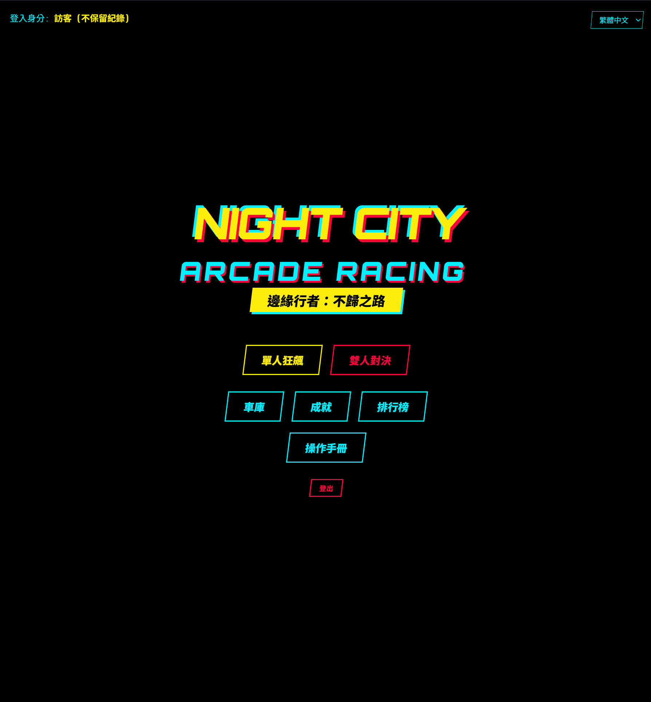
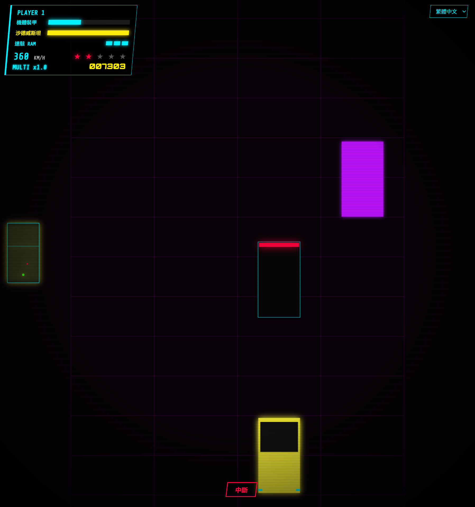
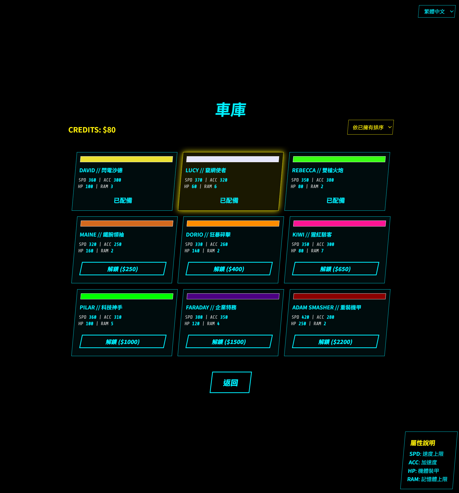
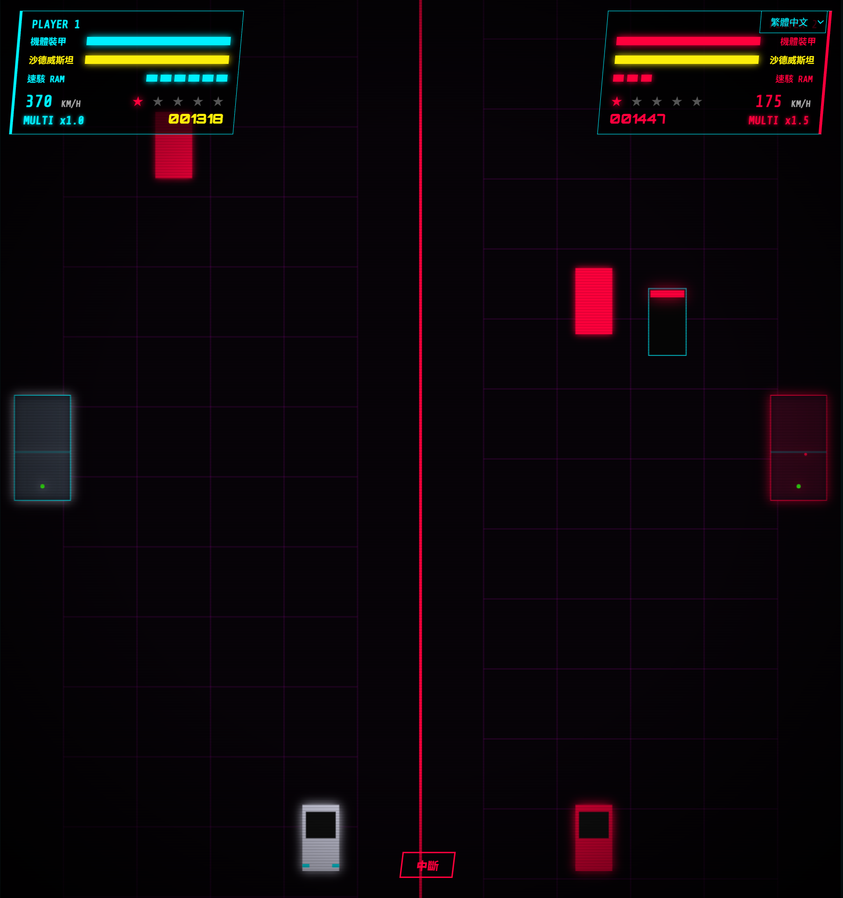

<h1 align="center">NIGHT CITY ARCADE RACING<br>邊緣行者：不歸之路</h1>

<p align="center">
  <a href="https://developer.mozilla.org/en-US/docs/Web/HTML"></a>
  <a href="https://developer.mozilla.org/en-US/docs/Web/JavaScript"></a>
  <a href="https://developer.mozilla.org/en-US/docs/Web/CSS"></a>
  <a href="LICENSE"></a>
</p>

<p align="center">
  一款基於 HTML5 Canvas 與原生 JavaScript 開發的賽博龐克風格街機賽車遊戲。
  <br>
  <strong>追逐、駭入、生存。躲避 NCPD 的追緝，成為夜城的傳奇。</strong>
</p>

##  關於專案 (About The Project)

**NIGHT CITY ARCADE RACING** 是一款向經典街機賽車與《電馭叛客：邊緣行者》致敬的網頁遊戲。玩家將在高速公路上極速穿梭，利用「沙德威斯坦」與「EMP 速駭」來突破重重障礙與 NCPD 的追緝。

本專案為純前端技術開發，所有邏輯、渲染與程序化音效 (Procedural Audio) 皆封裝於單一 HTML 檔案中，極致輕量且隨開即玩。

##  遊戲截圖 (Screenshots)

|  |  |
| :---: | :---: |
| **主選單畫面** | **遊戲實機畫面** |
|  |  |
| **車庫系統** | **雙人對戰模式** |

##  核心特色 (Key Features)

-  **雙重遊戲模式**：支援「單人狂飆 (Solo Drive)」挑戰極限，以及「本機雙人對戰 (Local PvP)」的分割畫面死鬥模式。
-  **深度車庫系統**：在賽道上收集 Credits (黃色晶片)，解鎖 9 輛各具特色 (速度、加速度、裝甲、RAM) 的傳奇座駕 (包含 David, Lucy, Adam Smasher 等專屬機體)。
-  **戰術神經組件**：
  - **沙德威斯坦 (Sandevistan)**：消耗能量發動子彈時間，輕鬆穿梭車陣。
  - **EMP 速駭 (Quickhack)**：消耗 RAM (藍色晶片) 釋放電磁脈衝，瞬間摧毀周遭的 NCPD 警車。
-  **成就與排行榜**：內建 15 項挑戰成就，並具有基於 LocalStorage 的本機排行榜與存檔系統。
-  **多國語言支援 (i18n)**：無縫切換繁體中文、簡體中文、英文與日文。
-  **程序化音效系統**：運用 Web Audio API 即時生成引擎轉速聲與環境特效音，無需外部音檔。

## 🎮 操作方式 (Controls)

| 動作 (Action) | Player 1 (左側) | Player 2 (右側 / 雙人模式) |
| :--- | :---: | :---: |
| **移動 / 加減速** | `W` `A` `S` `D` | `↑` `↓` `←` `→` (方向鍵) |
| **沙德威斯坦 (子彈時間)** | `Space` (空白鍵) | `Enter` (回車鍵) |
| **速駭 (EMP 攻擊)** | `L-Shift` (左 Shift) | `R-Shift` (右 Shift) |

## 🚀 快速開始 (Getting Started)

由於本專案為單一檔案的靜態網頁應用程式，安裝與運行非常簡單：

1. **Clone 儲存庫：**
   
```bash
   git clone [https://github.com/您的帳號/night-city-arcade-racing.git](https://github.com/您的帳號/night-city-arcade-racing.git)
